# SIMULACR

Это приложение было разработано в рамках кейса "Лучшее мобильное приложение" на Международном хакатоне системы среднего профессионального образования "IT TECH 2024".

## Оглавление
1. [Скриншоты](#скриншоты)
    - [Приветственный экран](#приветственный-экран)
    - [Светлая тема](#светлая-тема)
    - [Темная тема](#темная-тема)
2. [Цели и задачи приложения](#цели-и-задачи-приложения)
3. [Используемые технологии](#используемые-технологии)
4. [Реализованный функционал](#реализованный-функционал)
5. [Результаты работы](#результаты-работы)
6. [Портфолио](#портфолио)

## Скриншоты

### Приветственный экран

  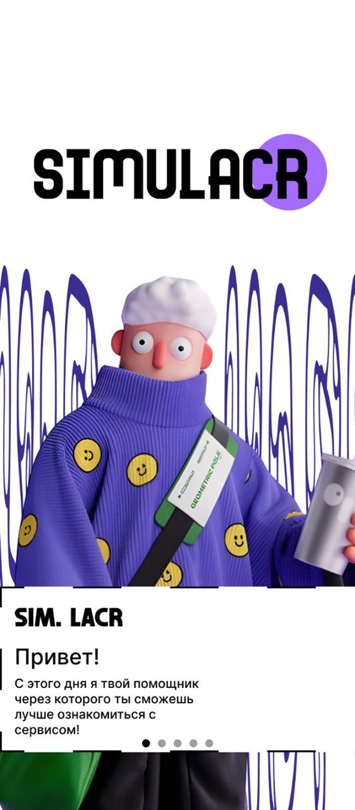
  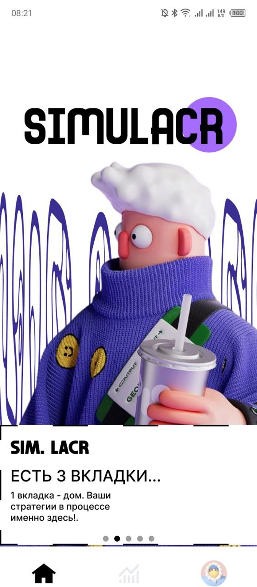
  
  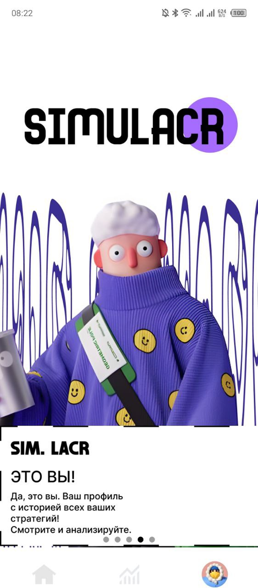
  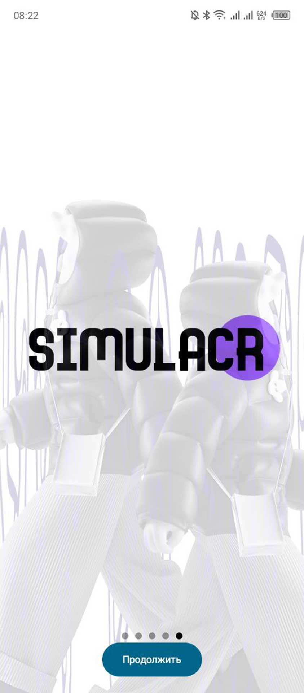

### Светлая тема

  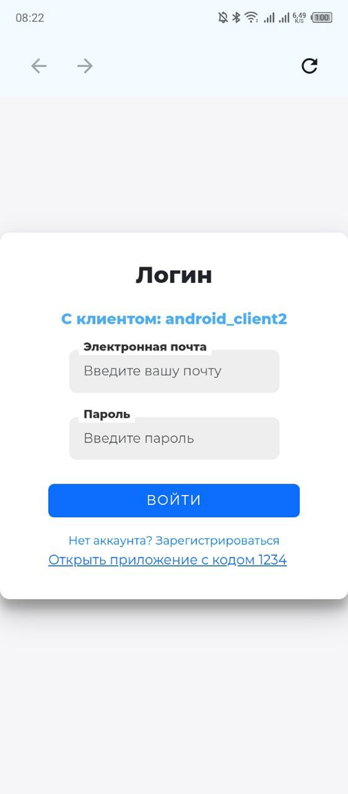
  
  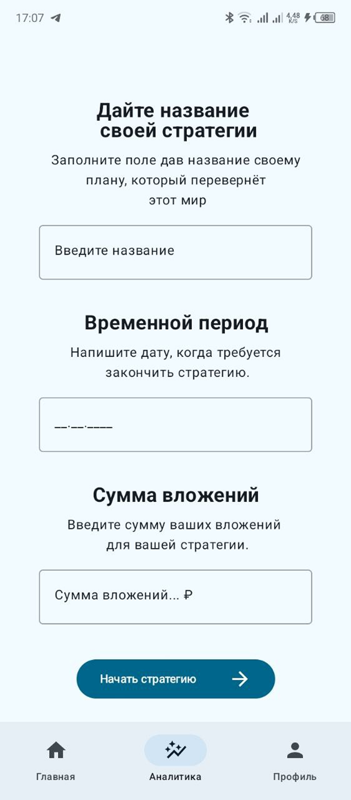
  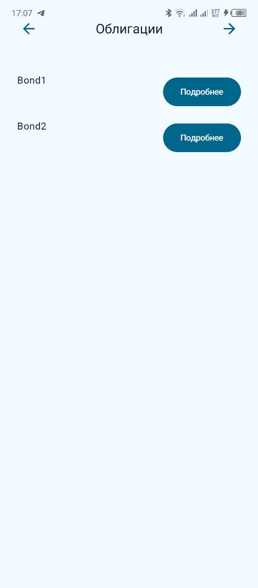
  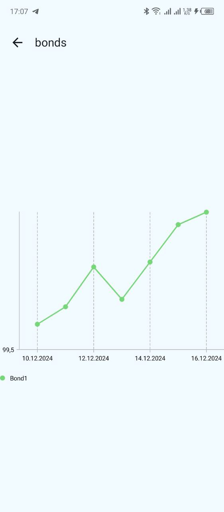
  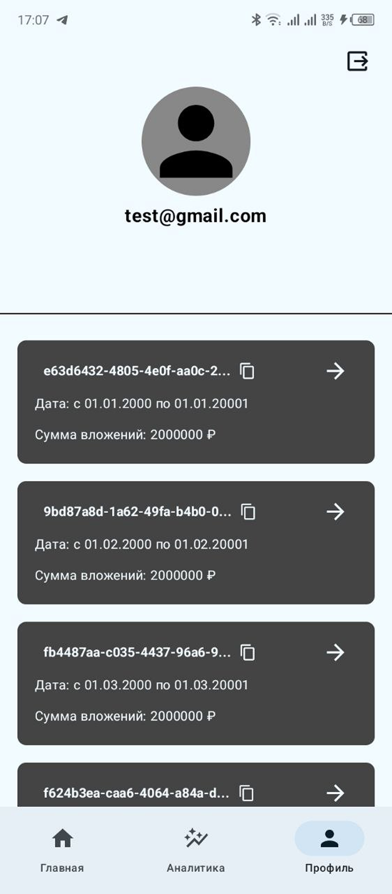

### Темная тема

  
  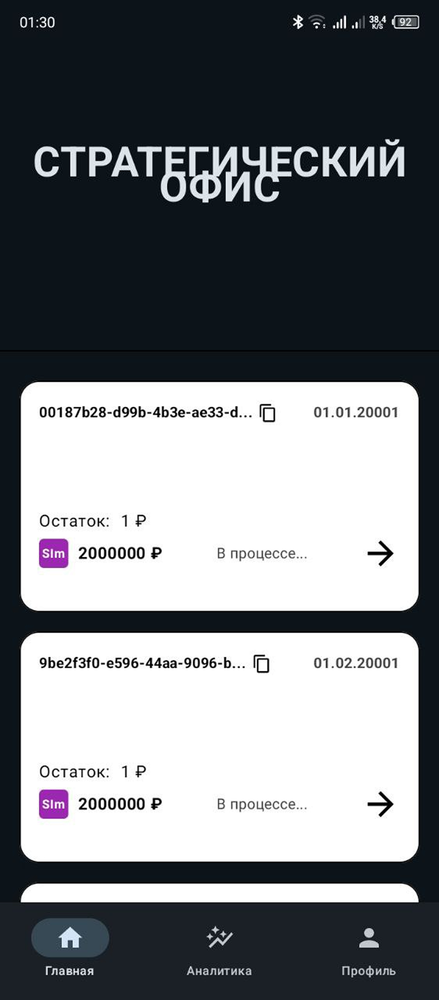
  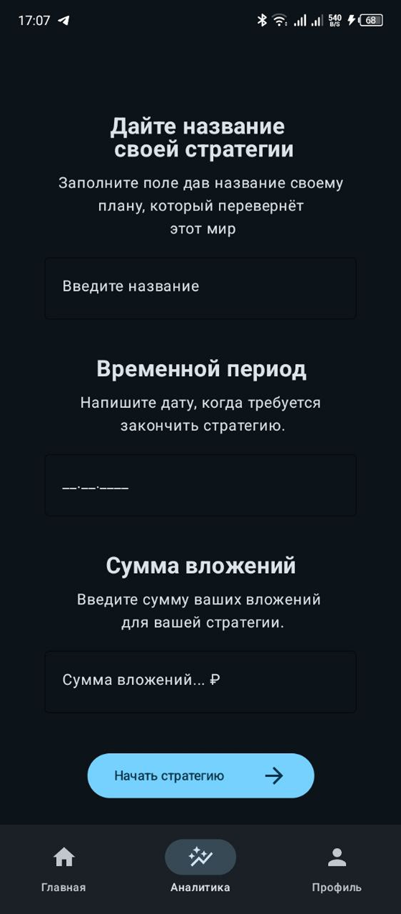
  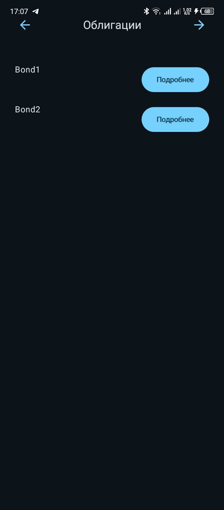
  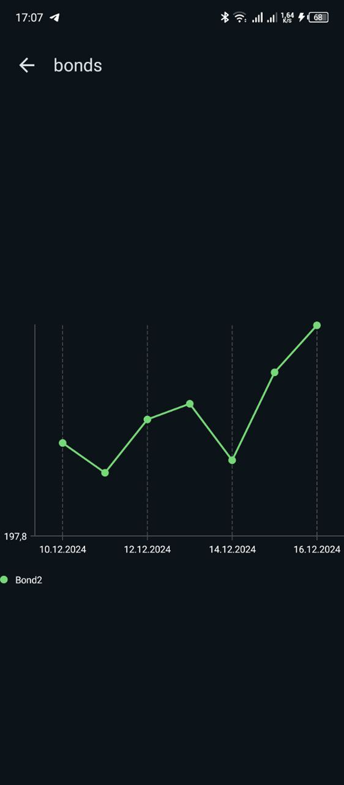
  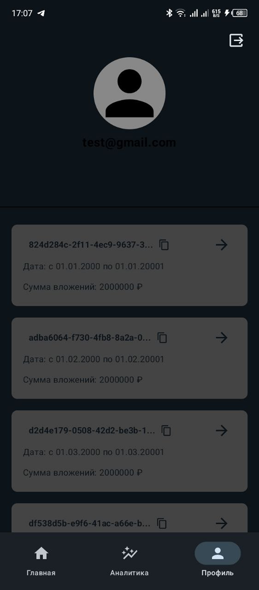

## Цели и задачи приложения
- **Симуляция инвестиций**: Расчет доходности портфеля на основе заданных параметров (сумма вложений, временной период).
- **Визуализация данных**: Отображение динамики активов с использованием графиков.
- **Удобство и доступность**: Создание интуитивно понятного интерфейса для пользователей.
- **Актуальные данные**: Получение и обновление данных об активах через API.

## Используемые технологии
| **Категория**              | **Технология**                                                               |
|----------------------------|------------------------------------------------------------------------------|
| **Архитектура**            | Clean Architecture с MVVM для разделения логики и интерфейса.                |
| **Сетевые запросы**        | Retrofit для работы с REST API.                                              |
| **Авторизация**            | Кастомная авторизация через WebView с использованием PKCE для защиты токенов. |
| **Локальное хранение**     | DataStore для хранения токенов, FileManager для сохранения данных об активах. |
| **Навигация**              | Type-safe навигация через Navigation Graphs.                                 |
| **Графики**                | Compose Vico Charts для визуализации данных.                                 |
| **Фоновые задачи**         | WorkManager для ежесуточного обновления данных.                              |
| **Управление зависимостями** | Dagger-Hilt для внедрения зависимостей.                                      |
| **Безопасность**           | Secrets Gradle для защиты конфиденциальной информации.                       |
| **Onboarding**             | HorizontalPager для реализации приветственного экрана.                       |

## Реализованный функционал
- **Авторизация**: Реализована кастомная авторизация через WebView с сохранением токенов в DataStore.
- **Получение данных**: Ежесуточное обновление данных об активах через API с использованием WorkManager и Retrofit.
- **Хранение данных**: Сохранение полученных данных в формате JSON с помощью FileManager и их конвертация через Gson.
- **Графики**: Визуализация динамики цен активов с использованием Vico Charts.
- **Onboarding**: Приветственный экран с использованием HorizontalPager.
- **Интерфейс**: Интуитивно понятный интерфейс с навигацией через Navigation Graphs.

   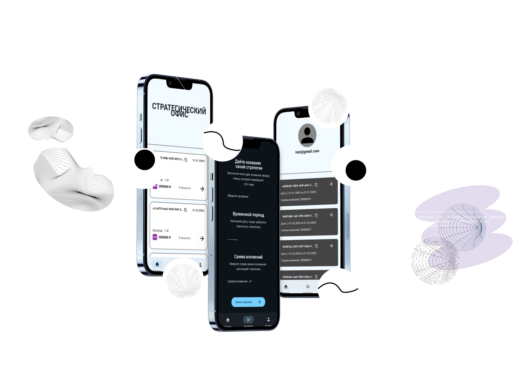 

## Результаты работы
Разработано мобильное приложение-симулятор, которое позволяет пользователям оценить доходность инвестиций на основе актуальных данных об активах. Приложение включает авторизацию, ежесуточное обновление данных, визуализацию графиков и удобный интерфейс. Оно готово к дальнейшей доработке, включая реализацию сохранения выбранных активов и интеграции с дополнительными функциями.

## Портфолио
Для более подробного ознакомления с проектом и другими моими работами, вы можете посетить мое портфолио на [Behance](https://www.behance.net/gallery/222004489/Android-Developer-Portfolio).